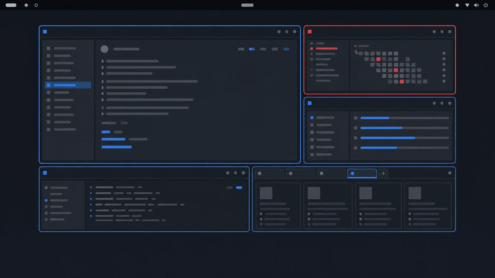

<div align="center">


# Anvil

<p><strong>Tree-based tiling that feels at home in GNOME</strong></p>

<p>
  <a href="metadata.json"></a>
  <a href="LICENSE"></a>
  
</p>

Anvil turns GNOME Shell into a fast, keyboard-friendly tiling environment without replacing the desktop you already use.

[Install](#install) · [User manual](docs/README.md) · [Default keybindings](docs/keybindings.md) · [Report an issue](https://github.com/GenKerensky/anvil/issues)

</div>

> [!NOTE]
> Anvil is a GPL-3.0 fork of [Forge](https://github.com/forge-ext/forge), originally created by [Jose Maranan](https://github.com/jmmaranan). See the full [credits](docs/project/credits.md).

## Contents

- [What Anvil does](#what-anvil-does)
- [Demo](#demo)
- [Install](#install)
- [Open the settings](#open-the-settings)
- [Learn Anvil](#learn-anvil)

## What Anvil does

Anvil automatically arranges windows in a tree of horizontal and vertical splits. You can navigate, move, swap, resize, float, stack, and tab windows with the keyboard, or reshape the layout with drag and drop. Layouts are maintained independently for each workspace and monitor.

## Demo

<!-- Replace this file with an animated WebP recording. Keep the path stable so README links do not need to change. -->

<div align="center">
  
  <br>
  <sub>Demo placeholder — an animated walkthrough is coming soon.</sub>
</div>

## Install

Anvil is currently installed from source. You need GNOME Shell **45 through 50.1**, Git, GNU Make, Node.js **24 or newer**, npm, gettext (`msgfmt`), and GLib schema tools (`glib-compile-schemas`).

```bash
git clone https://github.com/GenKerensky/anvil.git
cd anvil
npm install
make install
gnome-extensions enable anvil@GenKerensky.github.com
```

If GNOME Shell has not discovered a first-time installation yet, log out and back in, then run the final `gnome-extensions enable` command again. On X11, you can restart Shell with <kbd>Alt</kbd>+<kbd>F2</kbd>, enter `r`, and press <kbd>Enter</kbd> instead.

To update an existing source installation:

```bash
git pull --ff-only
npm install
make install
```

Restart GNOME Shell or log out and back in after updating when the running extension does not reload automatically.

## Open the settings

Use <kbd>Super</kbd>+<kbd>.</kbd>, open Anvil from the Extensions app, or run:

```bash
gnome-extensions prefs anvil@GenKerensky.github.com
```

## Learn Anvil

The [user manual](docs/README.md) covers every feature in its own guide. Start with:

- [Default keybindings and disabled GNOME shortcuts](docs/keybindings.md)
- [Automatic tiling](docs/features/automatic-tiling.md)
- [Keyboard navigation](docs/features/keyboard-navigation.md)
- [Drag and drop](docs/features/drag-and-drop.md)
- [Floating windows](docs/features/floating-windows.md)
